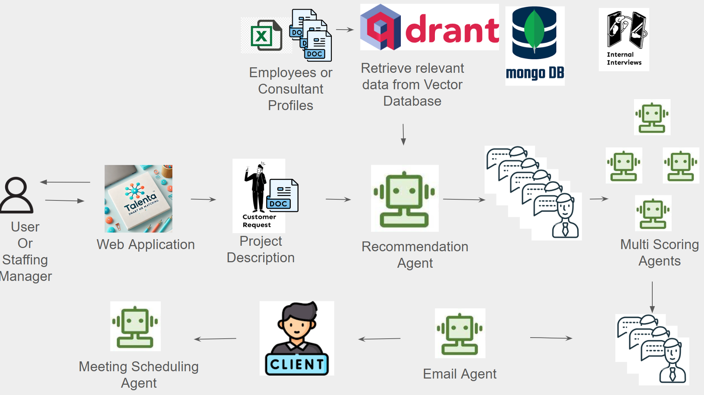

# Talenta

🚧 The Problem
Finding the right consultant for a project—or the right project for a consultant—is often a slow, manual, and imperfect process. Companies struggle to identify candidates with the right mix of skills, availability, and cultural fit, while consultants miss out on opportunities that align with their expertise and goals. Traditional platforms often fall short in adapting to fast-changing project requirements and individual preferences.

# 💡Solution

An AI-powered service or application that connects consultants with the most fitting projects by leveraging Multi-Agent AI Systems.
Participants are invited to explore how intelligent agents—each with specific roles—can collaborate to:
- Understand and match skills, experiences, and goals
- Recommend relevant opportunities dynamically
- Automate coordination between talent and project needs

# Tech Stack
- Qdrant Vector Database
- Python
- Langchain
- OpenAI
- Flask
- SMTP

# Installation and Setup

## For the Back End 
Please use the below steps to run the back end code

- Create an environment and activate it
- Create `.env` file and update the OpenAI API, Qdrant API Key
- Setup [qdrant](https://qdrant.tech/). Note: I have used qdrant cloud service. By setting up the cloud service one would get qdrant_url and qdrant_api_key. After uploading the documents to the qdrant cloud one would get the qdrant_collection_name 
```
QDRANT_API_KEY = ""
QDRANT_URL = ""
QDRANT_COLLECTION_NAME = ""
OPEN_AI_KEY = ""
OPEN_AI_EMBEDDING_MODEL = "text-embedding-3-large"
OPEN_AI_MODEL_NAME = "gpt-4o-mini"
NUMBER_OF_PROFILES_REQUIRED = "2"
```
- Use the below command to install the required packages
```
pip install -r requirements.txt
```
- To run the flask code use the below command
```
python main.py
```

## For the Front end 
Please use the below step to run the front end code
- Please https://github.com/jordibernandi/q_hack_25_exxeta_fe

# Architecture

<p align="center">
  
</p>
<p align="center">
    <b>Application Architecture</b> 
</p>
